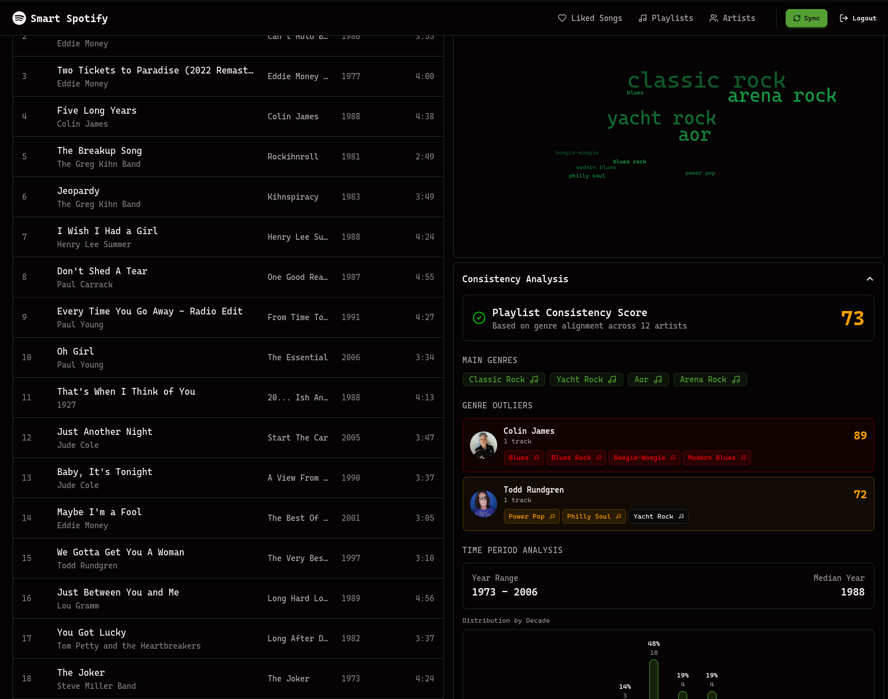
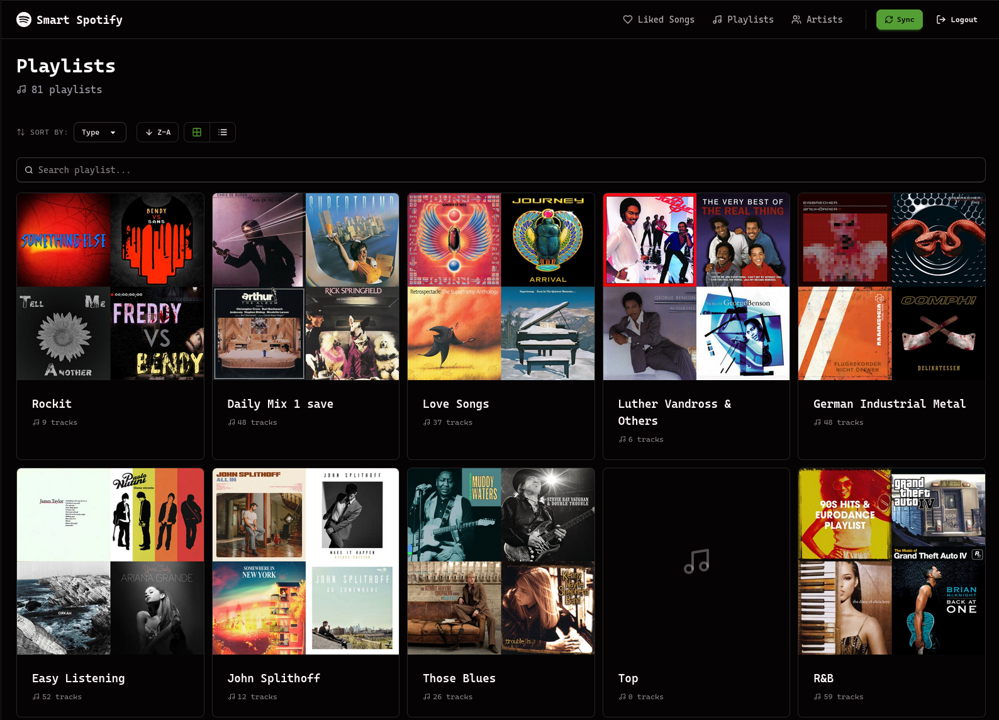
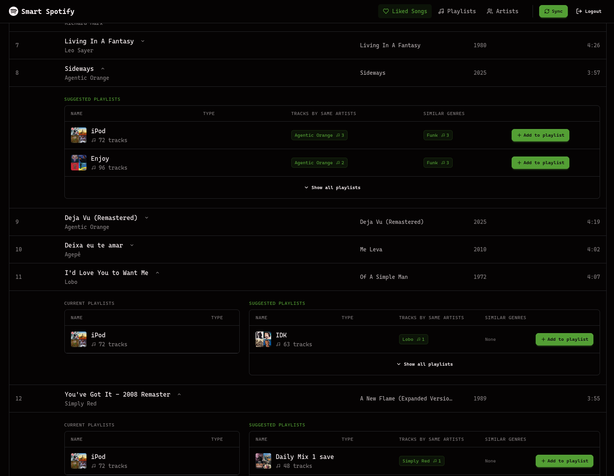
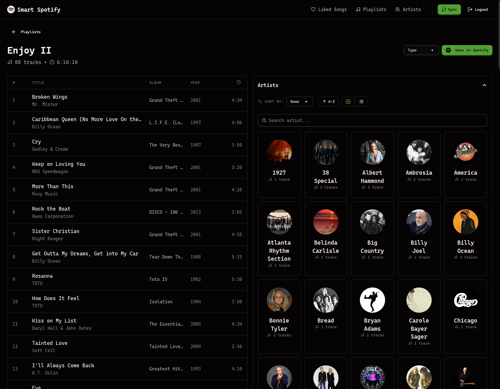

<div align="center">
  
  <h1>Smart Spotify</h1>
  <p>Smart playlist manager for your Spotify library.</p>
  
  [](https://react.dev)
  [](https://www.typescriptlang.org)
  [](https://nodejs.org)
  [](https://expressjs.com)
  [](https://redis.io)
</div>

---

## Screenshots



<details>
<summary>View more</summary>



</details>

## Prerequisites

- Node.js (v24 or higher)
- pnpm
- Redis
- Spotify Developer Account

## Local development

Create env file:

```env
# Backend
PORT=3001
CLIENT_URL=http://127.0.0.1:5173
NODE_ENV=development

# Spotify OAuth
SPOTIFY_CLIENT_ID=your_spotify_client_id
SPOTIFY_CLIENT_SECRET=your_spotify_client_secret
SPOTIFY_REDIRECT_URI=http://127.0.0.1:3001/api/auth/spotify/callback

# YouTube (Google) OAuth
# Enable "YouTube Data API v3" and create an OAuth Client ID (Web).
YOUTUBE_CLIENT_ID=your_google_oauth_client_id
YOUTUBE_CLIENT_SECRET=your_google_oauth_client_secret
YOUTUBE_REDIRECT_URI=http://127.0.0.1:3001/api/auth/youtube/callback

# Redis (optional; defaults to localhost:6379 if REDIS_URL is unset)
# REDIS_URL=redis://localhost:6379
```

Start the local development server

```bash
# In the root directory
pnpm dev
```

This will start:

- Frontend: http://localhost:5173
- Backend: http://127.0.0.1:3001

## Project Structure

```
smart-spotify/
├── frontend/          # React frontend application
│   ├── src/
│   │   ├── components/  # React components
│   │   ├── pages/       # Page components
│   │   ├── services/    # API client
│   │   └── utils/       # Utility functions
├── backend/           # Express backend server
│   ├── src/
│   │   ├── routes/      # API routes
│   │   ├── services/    # Business logic
│   │   ├── middleware/  # Express middleware
│   │   └── jobs/        # Background jobs
└── shared/            # Shared TypeScript types
    └── src/
        ├── types.ts     # Type definitions
        └── parser.ts    # Data transformers
```

## API Endpoints

### Authentication

- `GET /api/auth/spotify/login` - Initiate Spotify OAuth flow
- `GET /api/auth/spotify/callback` - Spotify OAuth callback
- `POST /api/auth/spotify/logout` - Logout (Spotify)
- `GET /api/auth/spotify/me` - Current user (Spotify)
- `POST /api/auth/spotify/refresh` - Refresh Spotify access token

- `GET /api/auth/youtube/login` - Initiate YouTube OAuth flow
- `GET /api/auth/youtube/callback` - YouTube OAuth callback
- `POST /api/auth/youtube/logout` - Logout (YouTube)
- `GET /api/auth/youtube/me` - Current user (YouTube)
- `POST /api/auth/youtube/refresh` - Refresh YouTube access token

### Data Persistence

- `POST /api/persist` - Start data sync job
- `GET /api/persist/status` - Get sync status
- `DELETE /api/persist` - Delete cached data

### Playlists

- `GET /api/playlists` - Get all playlists
- `GET /api/playlists/:id` - Get playlist details
- `GET /api/playlists/:id/tracks` - Get playlist tracks
- `GET /api/playlists/:id/analyze` - Get playlist analysis
- `POST /api/playlists/:id/tracks` - Add track to playlist
- `PATCH /api/playlists/:id/type` - Update playlist type

### Artists

- `GET /api/artists` - Get all artists
- `GET /api/artists/:id` - Get artist details
- `GET /api/artists/:id/tracks` - Get artist tracks

### Tracks

- `GET /api/tracks/saved` - Get saved tracks
- `GET /api/tracks/aggregate` - Get track recommendations

## License

MIT
